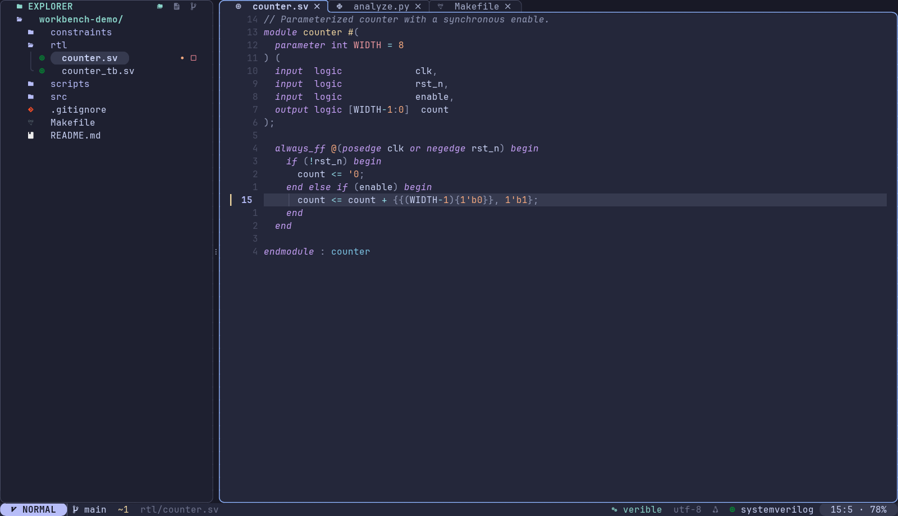
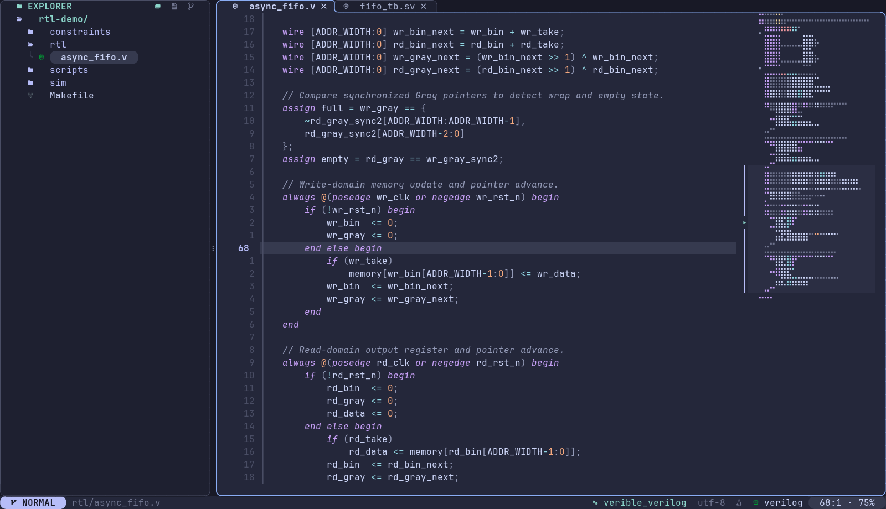

# neovim-workbench

面向 C/C++、Python、Verilog/SystemVerilog、Perl、Tcl 和 Makefile 的个人 Neovim 工作环境。采用 Catppuccin Macchiato、独立文件树与编辑器窗格、与活动标签相接的焦点边框，以及置于状态栏的按键记录。

配置直接使用 Neovim 的 `vim.pack` 管理插件，不依赖 LazyVim 或 lazy.nvim。可以从 [逐文件配置说明](docs/CONFIGURATION.md) 了解每个模块，再按自己的习惯修改。



上图是示例文件的 Neovim 网格渲染预览，展示专用 Geometry 6 字体模式。默认兼容模式使用标准字符边框；完整圆角外观需要安装附带字体，并按照 [字体说明](fonts/README.md) 设置终端。界面仍受终端字符网格限制。

## 文档入口

| 文档 | 内容 |
| --- | --- |
| [逐文件配置说明](docs/CONFIGURATION.md) | 加载顺序、每个配置文件的职责、主要参数和修改位置 |
| [语言环境](docs/LANGUAGES.md) | LSP、格式化、缩进、项目配置和外部工具 |
| [快捷键](docs/KEYMAPS.md) | 文件树、窗口、标签、搜索、补全、终端和构建 |
| [常见问题](docs/TROUBLESHOOTING.md) | 字体、行高、工具缺失、窗口焦点和平台差异 |
| [字体与终端](fonts/README.md) | Geometry 6 安装、行高、Windows Terminal 配色 |
| [第三方说明](THIRD_PARTY.md) | 字体来源、修改和图标许可证 |

## 环境要求

- **Neovim 0.12 或更新版本**。当前配置在 Fedora WSL 的 Neovim 0.12.5 验证。
- **Git**：首次启动会下载锁定的 20 个插件，需要能访问 GitHub。
- **Nerd Font Mono**：在实际运行 Neovim 的终端中选择字体，用于文件图标和状态栏符号。
- **ripgrep (`rg`)**：全文搜索；**fd** 为文件搜索的可选加速工具。
- **Tree-sitter CLI ≥ 0.26.1、C 编译器、curl、tar**：安装语法解析器时需要；按照 CLI 官方发行或系统包管理器安装，避免通过 npm 安装。
- 各语言服务器和格式化器按需安装，见 [语言环境](docs/LANGUAGES.md)。Python 3 还用于可选的 WSL 终端行高脚本。

`nvim-treesitter` 的版本要求见 [上游说明](https://github.com/nvim-treesitter/nvim-treesitter)。Linux/macOS/原生 Windows 的配置路径均使用 `stdpath`；目前实际验证的平台为 Fedora WSL，其他平台的终端与外部工具需按文档配置。

## 下载与试用

建议先使用独立应用名试用，原有 `nvim` 配置可以继续使用。插件、缓存、撤销记录也会独立保存。

**Linux、macOS、WSL（以下命令使用 Bash/Zsh）：**

```sh
config_home="${XDG_CONFIG_HOME:-$HOME/.config}"
mkdir -p "$config_home"
git clone https://github.com/faneikuangtu12138/neovim-workbench.git "$config_home/neovim-workbench"
NVIM_APPNAME=neovim-workbench nvim
```

Fish 启动命令使用 `env NVIM_APPNAME=neovim-workbench nvim`。克隆目标目录必须尚不存在；已有克隆可在目录中执行 `git pull --ff-only`。

**原生 Windows（PowerShell）：**

```powershell
$workbenchConfig = Join-Path $env:LOCALAPPDATA 'neovim-workbench'
git clone https://github.com/faneikuangtu12138/neovim-workbench.git $workbenchConfig
$env:NVIM_APPNAME = 'neovim-workbench'
nvim
```

这里的环境变量只影响当前 PowerShell 会话。删除它可回到默认配置：`Remove-Item Env:NVIM_APPNAME`。如果自定义了 `XDG_CONFIG_HOME`，请改为克隆到其下的 `neovim-workbench`。Windows 用户也可以将配置安装在 WSL 内，字体则安装到 Windows Terminal 所在的 Windows。

**作为默认 `nvim` 配置：**

在未设置 `NVIM_APPNAME` 的 Neovim 中执行 `:lua print(vim.fn.stdpath("config"))`，先备份该目录，再把仓库克隆到这个位置。常见路径为 Linux/macOS/WSL 的 `~/.config/nvim`、原生 Windows 的 `%LOCALAPPDATA%\nvim`。不要把已有配置直接覆盖；独立应用名试用完成后再切换。

## 首次启动

1. 等待 `vim.pack` 下载插件；`nvim-pack-lock.json` 保存当前经过验证的插件提交。
2. 执行 `:Mason`，按 [语言环境](docs/LANGUAGES.md) 选择所需工具。也可以使用系统工具，确保其可执行文件在 PATH。
3. 安装好 Tree-sitter CLI 和编译工具后，执行 `:TSInstallWorkbench` 下载本配置的 16 个解析器。启动时不会自动更新解析器或安装语言工具。
4. 执行 `:checkhealth`，再查看 `:checkhealth vim.lsp`、`:ConformInfo`。打开自己的项目测试补全、跳转和格式化。

按 `<Space>e` 切换文件树焦点；`Ctrl+h/j/k/l` 在实际内容窗格之间移动。文件树中按 `a` 新建文件或目录，回车打开，详细操作见 [快捷键](docs/KEYMAPS.md)。

按 `<Space>uv` 显示 / 隐藏右侧代码缩略图，也可使用 `:MinimapOpen`、`:MinimapClose`、`:MinimapToggle`。默认关闭；缩略图与编辑区共用外围边框，用细密点阵和正文语法颜色展示缩进、空行及代码分区，并标出视野、光标和诊断。默认 24 列、固定每个点对应两列正文、每个字符压缩四行，覆盖前 80 显示列；长文件随编辑视野滚动，右侧细条指示全文件位置，避免缩成实心色块。它不是可阅读的小字号正文。窗口太窄时暂时隐藏，恢复宽度后自动出现；欢迎页与工具窗口不生成缩略图。开关按 Neovim Tab page 独立保存，仅在当前会话生效。



预览来自真实 Neovim UI 网格和本机字体栅格，展示 Geometry 模式下的示例 Verilog 文件；实际终端的字符形状会随字体及缩放变化。

## 自定义

在配置目录中将 `local.example.lua` 复制为 **`local.lua`**，编辑这个文件。它会在插件与界面加载前读取，而且已被 Git 忽略，不会随着仓库更新被覆盖或上传。

```lua
return {
  round_tabs = false, -- 安装并选中 ForgeMono Geometry 6 NF 后改为 true
  line_height = 1.42, -- 无本地行高缓存时的字形几何默认值
  terminal_ui = {
    enabled = true,
    profile = "Fedora", -- Windows Terminal 中实际使用的 profile 名称
    -- guid = "{你的 profile GUID}", -- 同名 profile 时请显式指定
  },
}
```

`line_height` 指定 Neovim 使用哪组圆角字形，不能直接改变任意终端的字符行高。WSL + Windows Terminal 可以用 `:UiLineHeight 1.48` 同步调整实际终端并保存本地几何缓存；其他终端需在其设置中手动调整。文件树、编辑器与标签共用终端行高，无法独立设置不同的像素高度。缓存优先于 `local.lua` 的默认高度，详见 [字体说明](fonts/README.md)。

常用修改位置：

| 想修改的内容 | 配置文件 |
| --- | --- |
| 字体模式、终端 profile、默认几何行高 | `local.lua` / [示例](local.example.lua) |
| 行号、鼠标、搜索、默认缩进 | [core/options.lua](lua/core/options.lua) |
| 快捷键与文件树焦点 | [core/keymaps.lua](lua/core/keymaps.lua)、[core/navigation.lua](lua/core/navigation.lua) |
| 配色、标签、文件树、欢迎页 | [colorscheme.lua](lua/config/colorscheme.lua)、[tabs.lua](lua/config/tabs.lua)、[neotree.lua](lua/config/neotree.lua)、[dashboard.lua](lua/config/dashboard.lua) |
| 缩略图宽度、密度、隐藏阈值和刷新频率 | [minimap.lua](lua/config/minimap.lua)、[minimap_render.lua](lua/config/minimap_render.lua) |
| 各语言缩进、格式化、保存时格式化 | [core/autocmds.lua](lua/core/autocmds.lua)、[formatting.lua](lua/config/formatting.lua) |
| LSP、解析器、补全、模板 | [languages.lua](lua/config/languages.lua)、[treesitter.lua](lua/config/treesitter.lua)、[completion.lua](lua/config/completion.lua)、[snippets/](snippets/) |
| Verilog/SV 检查与补全隔离 | [hdl.lua](lua/config/hdl.lua)、[语言说明](docs/LANGUAGES.md#verilog--systemverilog) |
| 构建和终端 | [terminal.lua](lua/config/terminal.lua) |

`local.lua` 只用于示例中列出的设置；一般选项、快捷键和插件仍在各自模块中修改。详细参数与依赖见 [逐文件配置说明](docs/CONFIGURATION.md)。项目格式规则优先放在项目自己的 `.clang-format`、`pyproject.toml`、`.perltidyrc`、`.stylua.toml` 等文件中。

默认关闭保存时格式化，用快捷键手动格式化；C/C++、Python、Verilog/SystemVerilog、Perl 使用 4 空格，Lua/Tcl 使用 2 空格，Makefile 使用真正的 TAB、显示宽度 8。大于 1 MiB 或 20,000 行的文件会减少语言分析开销。

`.v/.vh` 使用独立的 Verilog 检查规则和 Verilog-2001 片段，不要求将 `always @*` 等合法语法改为 SV；`.sv/.svh` 保留 SV 规则及模板。两种语言的单词补全也分开，详见 [语言说明](docs/LANGUAGES.md#verilog--systemverilog)。

## 更新与验证

最近一次完整检查及已修复的问题见 [配置检查记录](docs/AUDIT.md)。

在仓库目录执行 `git pull --ff-only`。直接修改跟踪文件后，请先提交自己的修改，或另建分支，以便解决后续更新冲突；`local.lua` 不受影响。

插件更新需主动执行 Neovim 的 `vim.pack.update()`，检查相关插件 API 和 UI 表现，再提交新的 lock 文件。圆角标签集成使用 bufferline 的内部接口，因此不要只更新插件而忽略实际多标签和焦点切换验证。

使用当前配置运行随仓库附带的基本检查：

```sh
# 在仓库根目录，使用上面的独立应用名安装后
NVIM_APPNAME=neovim-workbench nvim --headless -i NONE -S tests/smoke.lua
```

PowerShell 中设置应用名后，运行 `nvim --headless -i NONE -S tests/smoke.lua`。这个检查覆盖配置启动、语言识别、实际 TAB 插入及窗口导航；字体的像素外观仍需要在实际终端中检查。

另有不加载用户配置的分支检查 `nvim --clean --headless -l tests/portability.lua`，以及隔离的 Python 后台测试 `python3 -m unittest discover -s tests -p test_terminal_ui.py`。详情见 [测试文件说明](docs/CONFIGURATION.md#testssmokelua)。

安装 Verible 后，可运行 `NVIM_APPNAME=neovim-workbench nvim --headless -i NONE -S tests/hdl.lua` 验证 Verilog/SV 诊断、命名约束、代码修复、头文件、混合工程客户端及真实补全来源。安装了 Icarus Verilog 时，还会用 Verilog-2001 模式编译展开的模板；在 Fedora WSL 中这 11 类检查全部通过。

`NVIM_APPNAME=neovim-workbench nvim --headless -i NONE -S tests/tab_corner.lua` 检查标签与正文的左上连接、两种焦点和窗口裁剪/恢复，共 7 类检查。实际像素外观仍需结合终端字体验证。

`NVIM_APPNAME=neovim-workbench nvim --headless -i NONE -S tests/minimap.lua` 验证缩略图开关、布局空间回收、诊断与编辑更新、文件树导航、窄窗口恢复、多文件/分屏跟随、大文件滚动条和 Tab page 隔离。

`NVIM_APPNAME=neovim-workbench nvim --headless -i NONE -S tests/minimap_render.lua` 验证点阵密度、空白和 UTF-8、TAB 停靠点、长文件滚动、真实语法颜色与注入语言、无解析器后备和主题缓存；需要已安装相应解析器。

发布前已在 Fedora WSL 验证首次下载 20 个插件、15 类工作流检查、41 项平台分支检查和 4 项 Python 测试；实际 Neovim 网格也验证了兼容/Geometry 模式的文件树切换、多标签和极窄窗口恢复，含插入/可视模式。平台分支模拟不等于原生 Windows/macOS 的实机验证。

仓库只包含配置、模板、公开示例图与可选字体，不包含插件副本、个人编辑记录、工程源文件、终端完整设置或认证数据。附带字体与图标的授权、来源和修改记录见 [第三方说明](THIRD_PARTY.md)。
