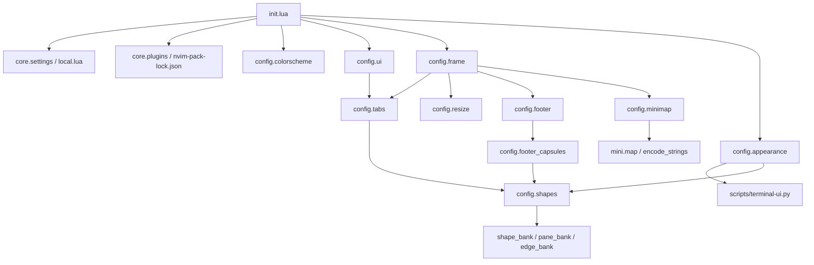

# 配置文件说明与修改指南

本页按文件说明配置职责、主要参数和模块关系。安装步骤见 [README](../README.md)，专用字体设置见 [字体说明](../fonts/README.md)。配置使用 Neovim 原生 `vim.pack` 和 LSP 接口；插件声明、编辑行为和界面布局都在本仓库中。

界面参考 VS Code 的侧栏、文件标签和底栏结构，实际由**终端字符网格、原生 split、状态栏、少量装饰窗口和字形**组成。它没有桌面 GUI 的任意像素布局能力。默认使用普通 Nerd Font Mono 兼容模式；Geometry 6 的专用圆角和连接字形需要另外安装字体并明确启用。文件树、正文、标签和底栏共用终端行高，不能分别设置像素高度。

## 入口、个人设置与加载顺序

### [init.lua](../init.lua)

这是唯一启动入口。先将 Leader / LocalLeader 设为空格，读取个人设置，再加载基础选项与插件。修改加载顺序时，应保证主题先于引用调色板的 UI 模块、个人设置先于 `config.shapes`、插件先于对应的 `setup()`。

当前顺序如下：

1. `core.settings.setup()` → `core.options` → `core.plugins`。
2. `core.navigation.setup()`、`core.autocmds.setup()`：登记窗口导航和编辑事件。
3. `config.colorscheme`，然后直接调用 `mason.setup()`；没有额外的 Mason 配置文件。
4. `config.completion` → `config.languages` → `config.treesitter` → `config.formatting` → `config.editor`。
5. `config.neotree` → `config.telescope` → `config.terminal.setup()` → `config.noice`。
6. `config.ui`：配置插件，并调用 `config.tabs.setup()`；标签模块读取 `config.shapes` 和字形银行。
7. `config.appearance.setup(terminal_ui)`：注册行高命令，启动时不执行终端后台脚本。
8. `config.frame.setup()`：启用原生窗格轮廓，同时启用 `config.footer`、`config.resize`。
9. `config.minimap.setup()`：注册代码缩略图命令与刷新事件，默认不开窗。
10. `config.dashboard` → `core.keymaps`：欢迎页和最终通用按键。

这些模块还会在事件回调中互相调用。核心关系为：

### [local.example.lua](../local.example.lua)

个人设置模板。将它复制为配置目录中的 `local.lua`，保留 `return { ... }` 结构。`local.lua` 被 Git 忽略，不应提交个人 profile、GUID 或设置文件路径。它提供参数，不是所有模块选项的通用覆盖器；更细的插件行为需要修改对应模块。

| 字段 | 默认值 | 用途与修改方式 |
| --- | --- | --- |
| `round_tabs` | `false` | 普通 Nerd Font Mono 模式。安装四个 Geometry 6 字体、匹配终端行高后，设为 `true` 使用专用字形。修改后重启 Neovim。 |
| `line_height` | `nil` | 字形银行的启动默认值，范围 `1.42–1.65`、步长 `0.01`。已有行高缓存优先；该字段本身不修改终端字体或行高。 |
| `terminal_ui.enabled` | `true` | 是否启用 Windows Terminal 后台集成；关闭后命令仅同步本地几何，不修改终端。 |
| `terminal_ui.profile` | `"Fedora"` | 你实际使用的 Windows Terminal profile 名称，可改为其他 WSL profile。 |
| `terminal_ui.guid` | `nil` | 精确选择 profile；名称重名时填写自己的 GUID。仓库不绑定某台机器的 GUID。 |
| `terminal_ui.settings` | `nil` | 显式指定脚本可读取的设置文件路径，适用于 Preview、非商店版或自定义位置。 |
| `terminal_ui.python` | `"python3"` | WSL 中执行后台脚本的 Python 程序。 |
| `terminal_ui.state` | `nil` | 行高缓存路径；默认位于 `stdpath("state")` 下的 `workbench-ui.json`。读写使用同一路径。 |
| `terminal_ui.backup_dir` | `nil` | 修改终端行高前的设置备份目录；默认位于 `stdpath("state")` 下的 `terminal-ui-backups`。 |

### [lua/core/settings.lua](../lua/core/settings.lua)

读取 `local.lua`，将其与 `defaults` 深度合并，并验证 `round_tabs`、`line_height` 和 `terminal_ui` 的基本类型。`setup()` 把字体模式、默认高度和缓存位置传给 `vim.g.workbench_round_tabs`、`vim.g.workbench_line_height`、`vim.g.workbench_ui_state`；其他模块通过 `get()` 读取设置。

新增公开参数时，应在这里添加默认值或校验、在 `local.example.lua` 增加示例，再在使用该参数的模块中读取。此模块在基础选项之前运行；在 `local.lua` 中提前改 `vim.opt`，可能被之后的模块覆盖。

### [.gitignore](../.gitignore)

忽略 `local.lua`、交换文件、Python 缓存、测试输出和依赖目录。保留 `/local.lua` 规则，避免提交个人终端设置；新增本地生成目录时在这里补充规则。

### [.gitattributes](../.gitattributes)

配置与说明文本统一提交为 LF，TTF 与 PNG 明确按二进制处理，避免换行转换损坏字体或图片。上游许可证保持原始字节，使 `SOURCES.json` 中的校验哈希可复现。新增二进制资源类型时补充对应的 `-text` 规则。

## 基础编辑与窗口工作流

### [lua/core/options.lua](../lua/core/options.lua)

集中设置行号、相对行号、鼠标、搜索、分屏方向、撤销文件、折叠初始状态、空白符号和 UTF-8。常改项为 `number` / `relativenumber`、`scrolloff`、`wrap`、`timeoutlen`、`listchars`、`splitright` / `splitbelow`；全局缩进默认是 4 空格。

这里的 `laststatus`、`showtabline`、`fillchars` 和边框只是基础值。`frame` / `footer` / `tabs` 会接管最终布局，不能只改初始 `laststatus` 就期待改变底栏。按文件类型的缩进在 `core.autocmds` 中。

### [lua/core/plugins.lua](../lua/core/plugins.lua)

用 `vim.pack.add()` 声明所有插件、源码地址和部分版本约束。`confirm = false`、`load = true` 使声明的包加载到当前会话；首次缺少插件时需要网络。这里不安装 clangd、Ruff 等外部工具，也不安装 Tree-sitter 解析器。

添加插件时，增加 `src`，必要时指定 `name` / `version`，并在 `init.lua` 加载它的配置模块。删除插件时，同步调整依赖它的模块和按键。版本锁定数据在 `nvim-pack-lock.json`；包管理细节可在 Neovim 中查看 `:help vim.pack`。

### [lua/core/autocmds.lua](../lua/core/autocmds.lua)

处理扩展名识别、复制高亮、重新打开文件时恢复光标，以及文件类型缩进。WSL 中能找到 `win32yank.exe` 时启用 Windows 剪贴板；没有该程序时不强行设置此提供器。

| 文件类型 | 默认缩进 |
| --- | --- |
| C / C++、Python、Perl、Verilog / SystemVerilog | `expandtab = true`，`tabstop` / `shiftwidth` / `softtabstop = 4` |
| Lua、Tcl（含识别为 Tcl 的约束文件） | 2 空格 |
| Makefile / Make | `expandtab = false`，`tabstop = 8`、`softtabstop = 0`、`shiftwidth = 0`；配方使用真实 TAB 字节 |

修改默认缩进时，调整对应 `FileType` 回调。项目 `.editorconfig` 和格式化器规则可能改变最终行为；可用 `:setlocal expandtab? tabstop? shiftwidth? softtabstop?` 查看当前值。Makefile 中 TAB 的显示宽度为 8，不等于把一个 TAB 替换为 8 个空格。

### [lua/core/navigation.lua](../lua/core/navigation.lua)

按 Neovim Tab 记住最后的编辑窗口，提供 `editor_window()`、`return_editor()`、`focus_tree()`、`toggle_tree_focus()` 和 `toggle_tree_visibility()`。文件树打开文件、返回编辑区、搜索和项目终端共同使用这套状态。

`filesystem_path()` 排除欢迎页、未命名缓冲区、终端 URI 等虚拟路径；这些缓冲区不会触发文件树的路径揭示确认。`project_root()` 从真实文件或最近编辑窗口寻找 `.git`、编译数据库、Makefile、CMake、Python、Verible、Tcl 等工程标记，并回退到有效目录。要新增工程类型，修改根标记列表。

### [lua/core/keymaps.lua](../lua/core/keymaps.lua)

集中定义保存、搜索、文件树、缓冲区、窗口、Quickfix、终端和 UI 开关。`map()` 的最后一个参数是描述，也供 Which-key / Telescope 查看。Leader 为空格；补全按键另在 `completion.lua`，LSP 按键另在 `languages.lua`，Git hunk 按键在 `ui.lua`。

`空格 e` 在树与最近编辑窗口间切换；`Ctrl+h/j/k/l` 调用 `frame.move()`，跳过装饰窗口。`空格 bd` 使用 `mini.bufremove` 关闭缓冲区并保留布局。增加按键时先确定它是通用映射、文件类型映射还是仅 LSP 附加后的映射，再放到相应模块。

## 语言、补全、语法与格式化

### [lua/config/languages.lua](../lua/config/languages.lua)

配置 Neovim 原生 `vim.lsp.config()` / `vim.lsp.enable()`、诊断外观、扩展名和工具路径。把 Mason bin 与用户工具目录放入 PATH；根据平台选用路径分隔符。只为可执行文件已存在、文件类型匹配的普通缓冲区启动服务。

| 服务 | 职责与主要可改项 |
| --- | --- |
| `clangd` | C/C++ 等：后台索引、clang-tidy、补全；`cmd` 中可调整 flags。工程头文件、宏和编译选项应由 `compile_commands.json` / clangd 工程配置提供。 |
| `basedpyright` | Python 类型、导航、补全；默认 `typeCheckingMode = "standard"`、`diagnosticMode = "openFilesOnly"`。优先在项目 Pyright 配置中制定规则。 |
| `ruff` | Python 检查与修复；关闭其 hover，避免与 basedpyright 重复。 |
| `verible_verilog` | `.v` / `.vh` 语法与风格服务；关闭会要求将合法 Verilog 改成 SV 的规则。具体列表在 `config.hdl`；仍读取工程规则。 |
| `verible` | `.sv` / `.svh` 语法与风格服务；保留 SV 默认规则。两个 HDL 服务共用 Verible 程序，但客户端独立，根标记包含 `verible.filelist`。功能以服务器能力为准，不能代替仿真器和完整工程语义检查。 |
| `perlnavigator` | Perl 导航与诊断；可改 `perlPath`、warnings 等设置，依赖工程的 Perl 环境。 |
| `tclsp` | Tcl 检查服务，根标记包含 Tcl 配置；不承诺完整定义跳转、重命名或语义补全。 |
| `lua_ls` | Lua；Neovim 配置识别 `vim` 和运行时库，普通项目的 `.luarc.json` / `.luarc.jsonc` 保留优先。 |

`servers` 列表记录服务名、命令和文件类型。新增服务时同时添加配置和该列表；已有 LSP 默认配置来自 `nvim-lspconfig`。`LspAttach` 只注册服务器实际支持的方法快捷键。`:LspRefresh` 重新检查已安装工具，`:DevTools` 显示路径和缺失项；清单中的 Verilator、Bear 等条目不表示它们会自动执行。

大于 1 MiB 或 20,000 行的缓冲区不激活 LSP。更改这个阈值时，同步检查 `completion.lua` 和 `treesitter.lua`，避免三个模块的限制不同。

### [lua/config/completion.lua](../lua/config/completion.lua)

配置 Blink 的 `lsp`、`path`、`snippets`、`buffer` 四类补全来源，使用 Lua fuzzy 实现和 Neovim 默认 snippet 引擎。自定义 JSON 片段位于 `snippets/`，另加载 friendly-snippets。

通过 `sources.providers.snippets.opts.filter_snippets` 排除上游混有 SV 语法的 Verilog 片段，改用本仓库的 Verilog 模板；SV 和其他语言继续加载上游片段。`buffer.opts.get_bufnrs` 限制 HDL 单词补全只读取可见的同语言缓冲区，避免旁边的 `.sv` 将 `logic`、`always_comb` 等带入 `.v`。这两个回调在 `config.hdl` 中。

`preselect = false`、`auto_insert = false` 避免未选择就插入候选；回车接受已选项，TAB / Shift-TAB 跳转片段占位符，否则保留正常按键行为。可在 `keymap` / `sources.default` 修改按键和来源，在 `completion.documentation` 调整 250 ms 文档延迟。命令行补全关闭，由 Noice 自己的界面处理；大文件和特殊缓冲区禁用常规补全。

### [lua/config/hdl.lua](../lua/config/hdl.lua)

集中维护 Verilog 与 SystemVerilog 的编辑边界。`verilog_disabled_rules` 列出仅在 Verilog 客户端禁用的 SV 迁移及默认命名约束；`verilog_rules()` 转为 Verible 的 `--rules` 参数，并在工程 `.rules.verible_lint` 之后生效。`parameter-name-style` 不再要求局部参数用 CamelCase，同时放宽宏、生成块前缀、模块与文件名对应、Enable/Disable 参数名称约束。语法解析与其他 lint 规则保留。具体关闭项及原因见 [语言说明](LANGUAGES.md#verilog--systemverilog)。

`filter_snippets(filetype, path)` 只排除 friendly-snippets 的 `snippets/verilog.json`，个人 Verilog 片段仍可加载。`completion_buffers()` 将 `.v/.vh` 和 `.sv/.svh` 的可见缓冲区单词隔开，其他语言保留原有可见缓冲区补全范围。不要用关键词黑名单过滤所有候选，否则可能误删用户定义的标识符。

### [lua/config/treesitter.lua](../lua/config/treesitter.lua)

使用 nvim-treesitter `main` 分支接口和 Neovim 原生高亮 / 折叠。`M.parsers` 声明 16 个解析器；Verilog 和 SystemVerilog 共用 `systemverilog`。`filetypes` 控制哪些缓冲区启用树解析，未安装解析器时回退到内置语法。

`:TSInstallWorkbench` 是显式下载与安装入口，要求可用的 Tree-sitter CLI；启动不自动安装解析器。新增语言应同时更新解析器列表和文件类型映射。默认不使用 Tree-sitter 缩进，保留各文件类型的缩进规则；大文件停用解析和表达式折叠，使用手动折叠。

### [lua/config/formatting.lua](../lua/config/formatting.lua)

Conform 是唯一统一格式化入口：C/C++ → clang-format，Python → Ruff，Lua → StyLua，Verilog/SV → Verible，Perl → perltidy，Tcl/约束文件 → tclfmt。Makefile 不配置通用格式化器。

默认手动执行 `:Format` / `空格 cf`，支持可视选择；`空格 uf` 的保存格式化开关只作用于 C/C++、Python、Lua。`vim.b.disable_autoformat` 可关闭单缓冲区保存格式化。`lsp_format = "never"` 避免额外 LSP 格式化器参与。

项目格式化配置优先于默认回退：存在 `.clang-format` / `_clang-format` 时不追加 C/C++ 回退样式；存在项目或用户 StyLua 配置时不追加缩进 flags；Tcl 配置优先，`pyproject.toml` 只有包含 Tcl 配置时才算 Tcl 规则。Python、Perl 使用各工具自身的项目配置发现机制。无相应规则时，C/C++、Lua、Tcl 回退缩进读取当前缓冲区选项；Verible 的 `--indentation_spaces` 同样读取当前有效缩进，默认为 4。

常改项为 `formatters_by_ft`、各 formatter 的参数、`auto_filetypes` 和超时。修改工程风格应先放在项目配置中；只有需要改变所有项目的默认行为时才改这里。用 `:ConformInfo` 检查实际命令和可用性。

### [lua/config/editor.lua](../lua/config/editor.lua)

配置 mini.pairs、mini.surround、mini.ai、mini.bufremove、mini.trailspace 和 mini.indentscope。可改 `mini.ai.n_lines` 的对象搜索范围、缩进引导线符号和 100 ms 绘制延迟。删除缓冲区功能依赖 mini.bufremove，应与关闭缓冲区的按键一起维护。

`WorkbenchScope` 排除文件树、帮助、终端、Quickfix 等工具窗口；欢迎页还在 `dashboard.lua` 中主动停用缩进引导线，避免 `noautocmd` 创建页面时漏掉排除事件。

## 文件树、搜索、终端与浮窗

### [lua/config/neotree.lua](../lua/config/neotree.lua)

配置 Files / Bufs / Git 三种来源、图标、目录引导线、Git / 诊断标记和文件操作。`window.width = 34` 是初始树宽；拖动后的会话宽度由 `resize.lua` 保留。`filtered_items` 控制隐藏内容，`never_show` 默认排除 `.git`、依赖和缓存目录。

`a` / `A` 新建文件 / 目录，回车或 `l` 打开，`h` 收起，TAB 调用 `navigation.return_editor()`。`open_files_do_not_replace_types` 保护终端、Quickfix、帮助和装饰窗口，避免把文件误放进工具区。

`rounded_name()` 为选中节点绘制胶囊背景，并给其他名称预留同等宽度。选择快照在完整树渲染后更新，`refresh_capsule()` 合并 16 ms 延迟刷新，避免重绘期间查询半成品节点位置。要改名称截断、选择外观或文件过滤，分别修改这个组件、主题高亮和过滤表。

### [lua/config/telescope.lua](../lua/config/telescope.lua)

设置搜索窗口比例、圆角、候选顺序、预览和忽略规则。`layout_strategy = "flex"` 在窄窗口切换布局；可改 `width = 0.88`、`height = 0.82`、`flip_columns = 120` 和预览比例。

`file_ignore_patterns` 排除依赖、编译产物和波形文件，使用 Lua pattern 语法；`vimgrep_arguments` 配置 ripgrep 的文本搜索参数。具体搜索入口和工作目录由 `core.keymaps` / `core.navigation.project_root()` 决定，不在这里硬编码工程路径。

### [lua/config/terminal.lua](../lua/config/terminal.lua)

提供 `:TermToggle`、`:Build`、`:BuildResults`。终端以 Neovim Tab 与项目根目录为键保存 shell 会话，隐藏窗口后保留进程；关闭 Tab 的终端可按项目复用。默认终端高度为屏幕约 30%，限制在 5–12 行，可改创建 split 的计算。

构建命令由用户输入，初始建议 `make`，并按项目记住上一条命令。异步进程使用 Neovim 的 `shell` / `shellcmdflag`；要改 shell，应改这些选项，而不是在此写固定平台的 `-c`。构建结果使用独立 Quickfix ID，相对路径按构建目录解析；其他项目或已关闭 Tab 的后台结果不会抢走当前 Quickfix。终端模式双 ESC 返回普通模式。

### [lua/config/noice.lua](../lua/config/noice.lua)

配置命令输入、搜索输入、消息、通知和 LSP 文档浮窗。命令框位于约 `18%` 屏幕高度，宽度 60；`completion_row()` / `completion_height()` 保持命令补全在其下方并在缩放时重排。修改命令框位置时，应同时调整补全几何计算。

`notify.setup()` 控制通知 2.5 秒超时、宽高和渲染方式。`routes` 过滤部分保存和搜索边界消息；新增过滤条件应只针对明确不需要显示的消息。LSP signature 由 Blink 处理，Noice signature 和 progress 已关闭，避免重复提示。

几何回调会等待 Noice 的视图配置可用；无界面模式的窗口缩放不会访问尚未初始化的 `views`。正常界面中的命令框与补全仍一起重排。

## 主题、标签、轮廓与底栏

### [lua/config/colorscheme.lua](../lua/config/colorscheme.lua)

定义 Catppuccin Macchiato 和 `vim.g.workbench_colors`，统一正文 Base、侧栏 Mantle、窗格外侧 Chrome、浮窗、树选中项和明暗描边。`custom_highlights` 中的 `Workbench*` 名称供标签、边框、欢迎页和底栏引用；普通编辑器高亮和插件 integrations 也在这里。

更改配色时，要同步调色板和自定义高亮。Geometry 6 的 COLR 字形包含固定 Macchiato 颜色；换主题不能仅修改高亮就保证专用背景裁切仍吻合。普通字体模式没有这些专用颜色层。

### [lua/config/ui.lua](../lua/config/ui.lua)

组织 Bufferline、Lualine、Which-key、GitSigns 和 Screenkey。Bufferline 保留缓冲区模型、挑选与诊断能力；实际可见标签栏在 `tabs.lua`，仅修改 Bufferline 的 separator 选项不会改变自绘标签。

Lualine 在这里定义模式、Git、文件、诊断、LSP、按键、UTF-8、文件类型和位置；自动状态栏绘制被隐藏，由 `footer.lua` 把格式化结果放入独立底栏。要调整底栏信息及顺序，改 `sections`；按键记录位于 encoding 左侧。

Screenkey 的 `clear_after = 2`、`compress_after = 3` 和 `disable` 表控制清空、压缩和排除模式，不显示独立角落窗口。Which-key 延迟为 350 ms。GitSigns 的 hunk 导航、预览、stage / reset 和 blame 映射在 `on_attach`；reset 会实际修改 hunk，stage 会修改 Git 索引。

### [lua/config/tabs.lua](../lua/config/tabs.lua)

渲染单行标签、EXPLORER / Files / Bufs / Git 工具条和下方分屏标题。文件标签代表 **buffer**，不等同于 `:tabnew` 创建的 Neovim Tab。`layout()` 按显示单元计算宽度、裁切标题并保持当前标签在视口内；宽字符和字面 `%` 需继续正确处理。

当前标签与正文轮廓相接；相邻标签共用连接列，最左侧当前标签与窗格左沿接合。焦点描边粗细从 `frame.focused_window()` 获取，缓冲区是否选中与窗格是否有焦点分别处理。可改标题截断上限、标签文字和工具条显示阈值，但几何预算、鼠标目标和连接字形必须一起更新。

当第一个可见标签未选中时，其左侧角占用第二个保留单元，侧边下接正文圆角的顶部端点；最外侧单元留给正文的圆弧。第一个可见标签选中时，恢复由标签承担外围圆角、正文直线延续的结构。两种情况使用相同预算，标签文字位置和正文起始行不变；窄窗口裁剪后根据“第一个可见标签”判断，而不是固定缓冲区编号。

`setup()` 注册 `WorkbenchTabs` 等渲染 / 点击函数，接管 `vim.o.tabline`。左键选中指定窗格中的缓冲区；中键、右键和关闭按钮用 mini.bufremove 关闭缓冲区，保留窗口。`prepare()` / `model()` / `first_selected()` 为 frame 提供位置与连接信息。

### [lua/config/frame.lua](../lua/config/frame.lua)

为每个原生内容窗口建立左右各 1 列装饰 rail，利用窗口状态栏绘制底边，用保留区域内的少量不接收焦点的浮窗补齐连接处和 `⋮`。`panes()` 返回真实内容窗格的角色与坐标，供 tabs 和 resize 使用。

正文左上边框与 `tabs.first_selected()` 同步：首个可见标签未选中时使用 `body_top_left` 圆角，选中时向下连续；右上角继续使用正文圆角。Geometry 模式使用既有字形，普通字体模式的正文角回退为 `╭` / `╮`。

`focused_window()` 记住真实焦点：插件浮窗或 `nvim_win_call()` 临时上下文不应把明亮轮廓切到其他窗格。`move()` / `cycle()` 排除装饰窗口；通用 `Ctrl+h/j/k/l` 和部分 `Ctrl+w` 操作经由它们。`refresh()` 在重绘、分屏、缩放和配色变化时统一更新轮廓；小于 24 列或 8 行时降级。极窄布局会在重绘前移除装饰并临时解除固定宽度、均分内容窗格，避免侧栏挤压编辑区；随后恢复固定宽度属性，窗口放大后重新建立装饰。

不要仅调整 rail 宽度或删除退出回调：正文坐标、标签预算、拖动命中和底栏清理共同依赖布局。`QuitPre` / `WinClosed` 负责清理辅助窗口。最后一个 Tab 只剩一个真实编辑窗格时，`:close` 会安全拒绝；需要退出使用 `:q` / `:qa`，未保存内容仍由 Neovim 保护。

### [lua/config/resize.lua](../lua/config/resize.lua)

在树与右侧编辑窗格之间计算实际分隔区，路由鼠标 press / drag / release。命中分隔区才接管事件，其他位置保留原生鼠标行为；映射涵盖普通、可视、插入模式，拖动保留原焦点和模式。

当前树最小宽度为 14，扩大时尽量为相邻编辑区保留 24 列；修改限值要考虑狭窄终端。`remember_width()` 同步 Neo-tree 的会话宽度，防止其布局监测立即回弹；关闭重开树保留本次会话宽度，不会另写磁盘持久缓存。

### [lua/config/footer.lua](../lua/config/footer.lua)

每个 Tab 使用一个高度为 1 的全宽原生辅助窗口显示信息，窗格自己的底边仍是纯描线。`laststatus = 0` 只取消最后辅助窗口的额外状态栏；上面的内容窗格仍保留底边位置。极小布局移除辅助窗口，恢复普通状态栏。

底栏记住最近非树、非装饰的原生内容窗口，支持编辑器、终端和 Quickfix；树获焦点后保留原信息归属。`render()` 在该窗口上下文求值 Lualine、调用 `footer_capsules.decorate()`，再写入文本和 extmark 高亮。事件与 1 秒计时器合并刷新；改显示内容优先编辑 `ui.lua`，不要直接改已渲染 buffer。

### [lua/config/footer_capsules.lua](../lua/config/footer_capsules.lua)

修饰 Lualine 求值后的模式 / 位置胶囊，包括欢迎页 FORGE / 时间。依据相邻文字背景选择 lavender、teal、peach、red、overlay 对应的端点，Geometry 模式使用整格背景加专用反向裁切字形，普通模式保留标准 Powerline 端点。

`decorate()` 同时重算 UTF-8 字节高亮边界，避免更换码点后颜色错位；只识别 Lualine transitional separator，不替换文件名中的普通文字。要增加胶囊配色，需要同步 `palette_key()`、主题值和字形银行；不能只改分隔符字符或端点前景色。

### [lua/config/shapes.lua](../lua/config/shapes.lua)

是三个字形银行的统一接口。`set_height()` 将高度换算为整数键（例如 `1.48 → 148`），暴露 `edge_*`、`pane_*` 和标签角字符；普通模式换成 Unicode 边线并取消专用组合标记。

高度优先级为已有 `workbench-ui.json` 缓存 → `local.lua.line_height` → `1.42` 默认值。自定义 `terminal_ui.state` 也用于读取。改变模式通常需要重启，因为模块首次加载时保存开关；支持范围外的银行查找回退到 142，不能据此认为任意终端行高都能精确适配。

### [lua/config/shape_bank.lua](../lua/config/shape_bank.lua)

生成的四类标签切角 / 连接码点映射，数组顺序为 `top_left`、`top_right`、`join_left`、`join_right`。键 142–165 对应 24 档高度，由 shapes 读取；这是字形映射，不是可以直接调整半径的布局参数。

### [lua/config/pane_bank.lua](../lua/config/pane_bank.lua)

生成的窗格背景裁切与描线映射，包括四角、纵线、横线等 `cut_*` / `stroke_*` 名称。与对应字体中的全字符格几何一致；shapes 将其转换为 `pane_*` 接口。

### [lua/config/edge_bank.lua](../lua/config/edge_bank.lua)

生成的完整 UI 轮廓映射，包括普通 / 活动描边、标签共享连接、宽字符 / 普通字符的组合标记和胶囊别名。frame、tabs、footer_capsules 经由 shapes 使用它，不在模块里另写码点。

**这三个生成表必须与字体一起维护。** 不要把码点随意替换成另一个 Nerd Font 图标。修改几何需要重新构建对应字形、保持字宽与组合定位、生成匹配映射，并更新四个字体样式；Neovim 启动不生成字体，仓库中的表也不是字体构建器。只想调整现有行高时，使用 `line_height` / `:UiLineHeight`。

### [lua/config/dashboard.lua](../lua/config/dashboard.lua)

使用 mini.starter 定义 FORGE logo、Workspace / Setup 分组和 9 个操作入口。`dashboard_layout()` 根据当前窗格尺寸选择大 / 小 logo、双列或堆叠卡片，并在高度不足时先去除装饰，保留全部可访问操作。

修改 `logo`、`items` 和 footer 文字即可改变内容；`items` 的 `name`、`action`、`section` 应完整保留。布局刷新监听窗口尺寸与开关，重排后恢复原选项和查询。要改卡片间距或宽度，应保留按 `strdisplaywidth()` 计算，而不是按字节数或固定屏幕偏移。

### [lua/config/appearance.lua](../lua/config/appearance.lua)

注册 `:UiLineHeight [高度]`，读取 `core.settings` 的 `terminal_ui` 参数。参数范围为 `1.42–1.65`、步长 `0.01`；无参数用于查询 / 同步当前高度。受支持的 WSL + Windows Terminal 环境中，通过异步 `vim.system()` 调用 Python 后台，再更新 shapes、frame 和标签。

只有 WSL 且能识别 Windows Terminal 会话时才自动操作终端；在 WSL 明确指定 `terminal_ui.settings` 可使用自定义设置文件。其他环境或关闭集成时，不调用 Python 后台：无参数报告当前几何高度，带参数更新本地几何和缓存，实际终端行高仍需手动匹配。缓存写入采用临时文件加原子重命名。此模块不安装字体，也不更改终端配色。

## 后台脚本、片段、锁文件和仓库规则

### [scripts/terminal-ui.py](../scripts/terminal-ui.py)

Windows Terminal 行高后台，使用 Python 标准库和 POSIX 文件锁。默认设置文件查找需要 WSL 的 `powershell.exe` / `wslpath`；显式 `--settings` 可指向可读的自定义或测试文件，原生 Windows 不使用此 POSIX 后台。

| 参数 | 用途 |
| --- | --- |
| `--profile` | 按名称选择唯一 profile，默认 Fedora。 |
| `--guid` | 按指定 GUID 选择；名称重名时使用。 |
| `--settings` | 指定设置 JSONC 文件。 |
| `--state` | 指定 Neovim 几何缓存文件。 |
| `--backup-dir` | 设置修改前的备份目录。 |
| `--set` | 写入行高；省略则查询，不修改终端设置。 |

脚本解析 JSONC 的注释和尾随逗号，只重写目标 profile 的对象，其他 profile 和根字段保留。写入前备份原文件，并检查读取后是否被其他程序修改，然后原子替换；查询和设置都会同步缓存。CLI 输出 JSON，供 appearance 解析。维护时应保留唯一 profile 检查、范围校验、并发检查和备份，测试使用隔离的 `--settings` / `--state`。

### `snippets/` 的通用格式

这些文件使用 VS Code 风格 JSON，Blink 默认片段源读取配置目录的 `snippets/`。每条片段包含 `prefix`、`body`、`description`；`${1:name}` 是占位符，`$0` 是最终光标位置。新增片段应放入对应文件类型的 JSON。修改模板中的实际空格会改变插入内容；TAB / Shift-TAB 用于片段跳转。

| 文件 | 已有前缀与职责 | 如何修改 |
| --- | --- | --- |
| [snippets/verilog.json](../snippets/verilog.json) | `rtlmod` / `modu`、`seq`、`comb` / `al`、`for`、`fun` / `function`、`task`、`genfor`、`if`、`else`、`case`、`wh`、`initial` | Verilog-2001 写法，默认 4 空格、嵌套 8；`for` 使用命名块声明局部 `integer`，函数/任务采用分开的参数声明。 |
| [snippets/systemverilog.json](../snippets/systemverilog.json) | `rtlmod` 参数化模块、`ff` / `comb` | 默认 4 空格，嵌套 8；保留 `always_ff` / `always_comb` 对应的工程编码规则。 |
| [snippets/perl.json](../snippets/perl.json) | `plmain` 严格脚本、`sub` 子程序 | 可改函数参数模板，默认子程序正文 4 空格。 |
| [snippets/tcl.json](../snippets/tcl.json) | `proc` 过程、`clock` SDC 时钟 | 默认过程正文 2 空格；时序约束模板仍需按工程对象和单位调整。 |
| [snippets/make.json](../snippets/make.json) | `rule` 普通规则、`phony` 伪目标 | 配方字符串中的 `\t` 解码为真实 TAB，不能换为空格。 |

### [nvim-pack-lock.json](../nvim-pack-lock.json)

Neovim 包管理器的生成锁文件，记录每个插件的 `src`、确切 `rev` 和可选版本约束。它与 `core.plugins` 配合，使插件版本可审查、可复现；不锁定 Mason 工具、解析器二进制或字体。

通过包管理器的更新工作流产生它，并提交经过验证的改动；不手工编造 commit SHA。变更插件声明时应检查锁文件是否仍对应最终声明。

### [.stylua.toml](../.stylua.toml)

仓库自己的 Lua 格式化规则：2 空格、列宽 100、偏好双引号、固定函数调用括号。它影响配置源文件的 StyLua 格式，不把 C++ / Python / HDL 的编辑缩进变成 2。修改配置仓库风格时改这里；其他工程使用各自的格式化配置。

### [lua/config/minimap.lua](../lua/config/minimap.lua)

右侧代码缩略图的开关、原生辅助 split、编码、视野/光标/诊断标记和生命周期管理。复用已安装 `mini.nvim` 中 `mini.map.encode_strings()` 的公开接口；自行管理窗口几何，不使用 mini.map 默认的全屏浮窗。辅助窗口使用 `workbench-frame` 文件类型和 `minimap` 角色，窗口导航、文件标签和底栏跳过它；`span()` 向 `config.frame` 提供合并宽度，使标签和外边框覆盖正文与缩略图。

默认不开启。`core.keymaps` 的 `<leader>uv` 调用 `:MinimapToggle`；另有 `:MinimapOpen` 和 `:MinimapClose`。开关按 Tab page 独立保存，切换文件与真实编辑分屏时跟随正文来源。欢迎页不编码；文件树聚焦时保留最近编辑文件。宽度不足时暂停显示，重新放大后恢复，开关不会被自动清除。大文件只显示比例滚动条，不生成代码轮廓。

在本模块的 `M.config` 修改默认值，也可在 `init.lua` 的 `setup({ ... })` 中传入覆盖值，修改后重启：

| 参数 | 默认值 | 用途 |
| --- | --- | --- |
| `width` | `14` | 缩略图列宽，支持 6–40 列；3 列用于位置/诊断与间隔。 |
| `min_editor_width` | `48` | 保留给正文的最小列宽；不足时临时隐藏。 |
| `min_height` | `6` | 正文不足此行数时隐藏。 |
| `refresh_ms` | `80` | 文本、光标和诊断事件合并刷新的间隔，毫秒。 |
| `max_lines` / `max_bytes` | `20000` / `1048576` | 超过任一阈值只保留滚动位置指示。 |
| `max_columns` | `240` | 每行编码前读取的最大字符数，限制极长行的开销。 |

代码轮廓按 2×2 字符区域压缩为标准 Unicode 四分块图，不是可阅读的小字号代码。只读且不接收鼠标点击，正文的光标和视野由原编辑窗口控制。配色在 `config.colorscheme` 的四个 `WorkbenchMinimap*` 高亮组中；背景沿用编辑器底色，视野使用主题表面色，光标使用青色。开启期间用 200 ms 的轻量观察器检测网格变化，处理可视模式延迟派发缩放事件的情况；没有网格变化时不重编码，所有 Tab 都关闭后停止观察器。

### [tests/smoke.lua](../tests/smoke.lua)

基础工作流验证入口，共 15 类检查：配置与命令、实际插件 revision 与 lock 一致、本地几何缓存同步、10 类文件的识别与真实 TAB 输入、RTL 片段的 4 / 8 空格，以及新文件编辑保存后重复进入树和返回编辑区。使用临时文件，不修改终端设置。

它不参与 `init.lua` 启动，也不代表已覆盖所有终端、字体、语言服务或 UI 像素行为。执行方法和所需环境见仓库 README；新增回归用例应围绕可观察的用户行为。

### [tests/hdl.lua](../tests/hdl.lua)

加载完整配置及实际 Blink 片段、单词补全来源，使用真实 Verible LSP 验证同工程 `.v` / `.sv` 客户端隔离、`.vh` / `.svh` 识别、两种打开顺序、Verilog 不收到 SV 迁移诊断或代码修复、SV 规则仍生效、语法错误仍可见，以及工程其他规则继续生效。检查补全没有跨语言污染，SV 和 Python 的上游片段仍可用。

安装 Verible 后执行 `NVIM_APPNAME=neovim-workbench nvim --headless -i NONE -S tests/hdl.lua`（Fish 前加 `env`；PowerShell 先设置应用名）。检查包含大写 localparam、传统宏/生成块名称、不同模块与文件名。若 PATH 中有 Icarus Verilog，还会展开本仓库模板并用 `iverilog -g2001 -tnull` 编译，共 11 类检查；缺少 Icarus 时明确跳过编译检查。它只使用临时工程，不修改用户文件。

### [tests/tab_corner.lua](../tests/tab_corner.lua)

加载完整配置，检查实际标签行文本、原生边框缓冲区和正文起始行。覆盖第一个/第二个标签选中、编辑区/文件树焦点、窄窗口裁剪、恢复窗口和切回首标签，共 7 类检查。第二个标签选中时，第一个标签左边界内缩一列，与正文圆角的顶部端点连接；文字起始位置和正文高度不变。第一个可见标签选中时，标签承担外围圆角，正文侧边连续向下。

使用当前配置执行 `nvim --headless -i NONE -S tests/tab_corner.lua`；独立应用名安装需先按 README 设置应用名。这个测试验证结构和状态切换，像素连接还需用实际终端或原生字形栅格检查；本次另外检查了 Geometry 模式 96/192 DPI 下的粗/细边框连接。

### [tests/minimap.lua](../tests/minimap.lua)

加载完整配置，验证默认关闭和欢迎页等待、独立宽度与连续编辑器轮廓、代码/诊断/编辑刷新、保存后文件树与窗口导航、快捷键/命令及空间回收、窄窗隐藏与恢复、多标签和分屏跟随、关闭来源窗口、大文件比例指示及 Tab page 开关隔离，共 9 类检查。操作临时文件，不修改终端设置。

使用当前配置执行 `nvim --headless -i NONE -S tests/minimap.lua`；独立应用名安装先按 README 设置应用名。窗口像素外观仍需结合实际终端验证。

### [tests/portability.lua](../tests/portability.lua)

不加载用户配置或插件的便携性检查。验证不同 PATH 分隔符、shell / shellcmdflag 参数拆分、跨平台忽略规则、个人设置、缓存优先级和行高命令分支；OS / shell 分支通过替身模拟，不能据此宣称所有目标系统已实机验证。

在仓库根目录执行 `nvim --clean --headless -l tests/portability.lua`。它使用临时配置和数据，修改便携性逻辑后维护对应断言。

### [tests/test_terminal_ui.py](../tests/test_terminal_ui.py)

Python 后台的隔离测试：行高范围、JSONC、重复 profile 要求明确 GUID，以及查询 / 写入 / 缓存 / 备份行为。测试操作临时设置文件，不修改实际 Windows Terminal。

在支持此 POSIX 后台的环境中执行 `python3 -m unittest discover -s tests -p test_terminal_ui.py`；原生 Windows 的平台限制由用例区分，不能当作原生 Windows 后台可用性的证明。

## 字体、授权和非配置资源

四个字体文件是可选的 Geometry 模式资源，不由 `vim.pack` 安装：

| 文件 | 职责 |
| --- | --- |
| [fonts/ForgeMonoGeometry6NF-Regular.ttf](../fonts/ForgeMonoGeometry6NF-Regular.ttf) | 常规文字、图标和几何字形。 |
| [fonts/ForgeMonoGeometry6NF-Bold.ttf](../fonts/ForgeMonoGeometry6NF-Bold.ttf) | 真实粗体样式，包含对应几何字形。 |
| [fonts/ForgeMonoGeometry6NF-Italic.ttf](../fonts/ForgeMonoGeometry6NF-Italic.ttf) | 真实斜体样式。 |
| [fonts/ForgeMonoGeometry6NF-BoldItalic.ttf](../fonts/ForgeMonoGeometry6NF-BoldItalic.ttf) | 粗斜体样式。 |

安装位置取决于运行终端的平台。在 Windows Terminal + WSL 中，应安装到 Windows 并在实际 profile 选择该字体。启用专用模式前按 [fonts/README.md](../fonts/README.md) 同时匹配 `cellHeight`、`round_tabs` 和几何缓存；安装或更新字体后完整关闭并重开终端。

[fonts/OFL.txt](../fonts/OFL.txt) 保留基础字体授权；[fonts/licenses/SOURCES.json](../fonts/licenses/SOURCES.json) 记录图标许可证文本的来源和哈希。这些元数据不是 UI 参数，不应改成个人设置。各图标许可证逐项列于 [THIRD_PARTY.md](../THIRD_PARTY.md)，随字体分发时应保留相应授权文件。

[assets/workbench.png](../assets/workbench.png) 是界面预览资源，不参与渲染。它展示专用字体模式的网格效果；默认兼容模式的圆角、抗锯齿和实际终端效果可能不同。README、字体说明和本文是说明文档，不在 Neovim 启动时加载。

## 按需求找到修改位置

| 需求 | 主要文件 |
| --- | --- |
| 改默认缩进 / Make TAB | `core.autocmds`；项目 `.editorconfig` 与格式化规则 |
| 改按键 | `core.keymaps`；补全 / LSP / Git 专属按键分别在相应模块 |
| 增加语言服务 / 调整诊断 | `config.languages` |
| 调整 Verilog/SV 区分、迁移建议、补全隔离 | `config.hdl`；模板在 `snippets/verilog.json` / `snippets/systemverilog.json` |
| 增加格式化器 / 保存格式化范围 | `config.formatting` |
| 添加或改片段 | 对应 `snippets/*.json` |
| 改树过滤、初始宽度和节点显示 | `config.neotree`；拖动逻辑在 `config.resize` |
| 改底栏组件及排序 | `config.ui`；最终绘制在 `config.footer` |
| 改欢迎页 logo / 入口 | `config.dashboard` |
| 改标签文字、布局或点击 | `config.tabs` |
| 改缩略图宽度、隐藏阈值和刷新频率 | `config.minimap`；配色在 `config.colorscheme` |
| 改主题与常规高亮 | `config.colorscheme` |
| 改个人字体模式、profile 或缓存位置 | `local.lua`，由 `local.example.lua` 复制 |
| 改圆角几何本身 | 字体与三个生成银行一起维护；普通行高调整使用 `:UiLineHeight` |

修改后重启 Neovim 以验证完整加载顺序；热重载复杂窗口模块可能保留原定时器或事件状态。可用 `:checkhealth`、`:DevTools`、`:ConformInfo` 和 smoke 测试分别检查编辑器、外部工具、格式化与基础工作流。
